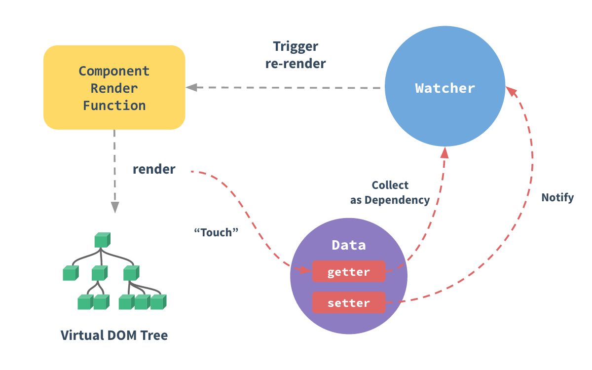

# 响应式系统

Vue2 基于`Object.defineProperty`实现「响应式系统」的。



## 演示操作

当点击按钮时，会打印`视图更新啦～`提示，表示更新数据，视图也会更新。

## 实现过程

- `defineReactive` 是对一个对象的属性进行响应式处理，get 的时候收集依赖，set 的时候更新视图
- `observer` 是循环遍历对象，对对象的每个顺序进行`defineReactive`响应式处理
- `Dep`订阅者类，主要是为每一个属性来收集 Watcher 实例
- `Watcher`观察者类，收集依赖，就是在视图中，每一处使用到属性的地方，都会有一个 Watcher 进行监听。

每个属性，Dep，Watcher 的关系：

- 每个属性都有一个 Dep 类，用来收集该属性所有的 Watcher
- 在视图中，每一处使用该属性的地方，都会被一个 Watcher 监听
- 如果该属性变了，就能从 Dep 中找到所有 Watcher，然后全部应用 Watcher 中的 update 方法，就能一次性更新视图中所有使用到该属性的地方

## 缺陷

上面的模拟 Vue 的响应式系统中，在 Vue 类的构造函数中创建了一个全局的 Watcher 对象，**这个 Watcher 会收集所有属性的依赖**，所以实际上是无法区分到底是哪个属性进行了修改。

而在实际的 Vue 源码中，会对每个属性单独创建 watcher，但是不是在 defineReactive 中创建的，因为在 defineReactive 中创建 Watcher 对象可能会导致问题。defineReactive 是定义在对象的每一个属性上的，如果在这里创建 Watcher，那么每当属性被访问时，都会创建一个新的 Watcher。这显然会导致内存和性能问题。

**在 Vue 框架中，Watcher 对象是在编译模板时，通过在最上层 Vue 实例的 $mount 函数中调用 mountComponent 而新建的。**

当节点中的绑定的表达式被求值时（即在渲染函数中被访问时），就会触发对应的 getter 函数，进行依赖收集。

## 补充：组件的渲染 watcher 和每个属性的 watcher

在 Vue 2 的源码中，每一个组件（即 Vue 实例）都有一个渲染`Watcher`，我们通常将其称为渲染`Watcher`或者组件的`Watcher`。这个`Watcher`的工作就是重新渲染整个 Vue 组件。

在组件中，每个需要动态更新的属性（例如模板中的插值绑定、`v-bind`绑定或者是计算属性等）都会对应有一个或者多个`Watcher`。当这些属性的值发生变化时，对应的`Watcher`会被触发，并且会触发组件的渲染`Watcher`，从而重新渲染整个 Vue 组件。

总的来说，一个 Vue 组件会有一个渲染`Watcher`，以及每个需要动态更新的属性对应的`Watcher`。这样做的目的是为了实现精确的更新，只有当依赖的数据发生变化时，才会重新计算和重新渲染，这样可以提高性能。

另外，对于用户自定义的`watch`，每个`watch`也都会对应一个`Watcher`实例。所以，一个 Vue 实例中可能会有多个`Watcher`实例，包括渲染`Watcher`、属性`Watcher`和用户自定义的`watch`的`Watcher`。

比如，让我们用一个图书馆的例子来解释这个概念。

假设你正在管理一个图书馆。这个图书馆有很多书（这些书对应 Vue 实例中的属性），你要确保所有的书都按时被归还（这对应于确保所有的数据都是最新的）。

每一本书都有一个专门的图书管理员（对应于每个属性的 `Watcher`），他们的任务是跟踪这本书何时被借走，何时被归还。当有人借走一本书或者归还一本书时，对应的图书管理员就会记录下这个信息。

同时图书馆还有一个总管理员（对应于 Vue 实例的渲染 `Watcher`）。他并不直接管理所有的书，但是当任何一本书的状态发生改变时，对应的图书管理员就会通知他。总管理员的任务就是根据这些信息，确保图书馆的整体运行正常（对应于确保整个 Vue 实例的视图是最新的）。

所以，总的来说，每一本书都有一个专门的图书管理员，而图书馆有一个总管理员。这就像在 Vue 实例中，每个属性都有一个 `Watcher`，而整个 Vue 实例也有一个渲染 `Watcher`。

## 代理

那么问题来了，我们需要对 `this._data.text` 操作才会触发 set。

为了偷懒，我们需要一种方便的方法通过 `this.text` 直接设置就能触发 set 对视图进行重绘。

那么就需要用到代理。

我们可以在 Vue 的构造函数 constructor 中为 data 执行一个代理[proxy](https://github.com/vuejs/vue/blob/dev/src/core/instance/state.js#L33)。这样我们就把 data 上面的属性代理到了 vm 实例上。

```js
_proxy.call(this, options.data); /*构造函数中*/

/*代理*/
function _proxy(data) {
  const that = this;
  Object.keys(data).forEach((key) => {
    Object.defineProperty(that, key, {
      configurable: true,
      enumerable: true,
      get: function proxyGetter() {
        return that._data[key];
      },
      set: function proxySetter(val) {
        that._data[key] = val;
      },
    });
  });
}
```

我们就可以用 `app.text` 代替 `app._data.text` 了。
