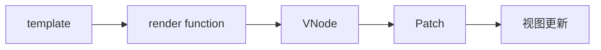
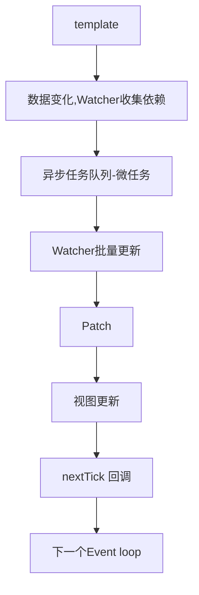

# 异步更新策略和 nextTick 原理

从之前的章节中，我们知道了从 template 到视图更新经过的过程如下：



但是，在 Patch 之后，并不是直接更新视图的，而是在异步队列中更新视图的。

## nextTick

`nextTick` 是 Vue.js 中的一个非常重要的 API。要理解 `nextTick` 的作用，我们首先需要了解 Vue.js 的异步更新队列。

Vue.js 使用异步队列来批量更新 DOM。也就是说，当你修改一个数据时，Vue.js 不会立即更新 DOM，而是将所有的依赖这个数据的 Watcher 对象放入一个队列中。这个过程被称为依赖收集。

然后，Vue.js 会等待当前同步代码执行完毕以后，在当前的宏任务（macrotask）或者同步任务完成后，即将开始的微任务阶段，开始批量执行队列中的 Watcher 对象。

这样做的好处是可以避免不必要的 DOM 更新，从而提高性能。

这就是 `nextTick` 的作用所在。`nextTick` 函数允许你在下一次 DOM 更新循环结束之后延迟执行一段代码。换句话说，`nextTick` 可以让你在数据改变之后，DOM 更新之后，执行一些操作。

下面是详细的步骤：

1. 当你修改一个响应式数据时，Vue.js 会触发这个数据的 setter 函数。
2. Setter 函数会通知所有依赖这个数据的 Watcher 对象，告诉它们数据已经改变。
3. 每个 Watcher 对象在接收到通知后，在 Watcher 的 update 中不会立即更新视图，而是将自己添加到一个全局的队列中。
4. Vue.js 有一个异步任务队列，并且使用 Promise 或者 MutationObserver 的微任务队列来延迟执行这个队列中的 Watcher 对象。
5. 当所有同步任务执行完毕，微任务队列开始执行，Vue.js 就会开始遍历这个 Watcher 队列，并且为每个 Watcher 对象执行其 run 方法，从而更新视图。在这个过程中，如果有多个 相同属性的 Watcher 对象，Vue.js 也只会更新一次视图，避免了不必要的计算和渲染，提高了性能。
6. 然后，nextTick 的回调函数会在 DOM 更新后（即所有的 Watcher 都已经执行，视图已经更新）被调用。因此，我们可以通过 nextTick 在 DOM 更新后执行一些任务，比如操作更新后的 DOM 元素。
7. 再然后，当所有的 nextTick 回调执行完后，Vue.js 就会开始执行后续的同步代码。这个过程就是 JavaScript 的事件循环（Event Loop）。

下面举个例子来帮助理解：

```javascript
new Vue({
  el: "#app",
  data: {
    message: "Hello Vue!",
  },
  methods: {
    updateMessage: function () {
      this.message = "Hello Vue3!";
      this.$nextTick(function () {
        console.log(this.$el.textContent);
      });
    },
  },
});
```

在这个例子中，我们首先更改了 `message` 的值，然后使用 `nextTick` 来确保 `console.log` 语句在 DOM 更新之后执行。如果我们没有使用 `nextTick`，那么 `console.log` 语句可能会在 DOM 更新之前执行，此时它仍然会输出原来的内容 "Hello Vue!"。

## Watcher 和 nextTick 的回调都是在微任务执行的

`Watcher` 的执行和 `nextTick` 的回调都是在微任务阶段执行的。`Watcher` 对象是响应 Vue.js 数据变动的观察者，当数据变动时，`Watcher` 对象会被添加到异步任务队列中，等待下一个微任务阶段执行。而 `nextTick` 的回调则是在 DOM 更新后（即所有的 `Watcher` 对象执行后）在同一个微任务阶段执行。

Vue.js 的异步任务队列利用了 JavaScript 的微任务（microtask）机制。微任务是在当前宏任务（macrotask）执行结束后，下一个宏任务开始前，执行的任务。因此，异步任务队列的执行时机刚好可以确保在 DOM 更新后立即执行。

至于实现这个异步任务队列，Vue.js 会优先尝试使用原生的 `Promise` 对象。如果环境中支持 `Promise`，那么 Vue.js 就会使用 `Promise.then` 来实现异步队列。如果环境中不支持 `Promise`，那么 Vue.js 会尝试使用 `MutationObserver`。如果环境中连 `MutationObserver` 都不支持，那么 Vue.js 会退而求其次，使用 `setImmediate` 或者 `setTimeout`。

因此，`Watcher` 的异步任务队列和 `nextTick` 的异步任务队列，它们的实现方式是基本一致的。都会优先使用 `Promise`，然后是 `MutationObserver`，最后是 `setImmediate` 或者 `setTimeout`。

## 现在

现在，template 到视图更新经过的过程如下


