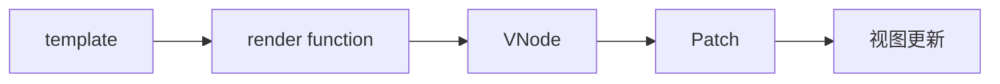
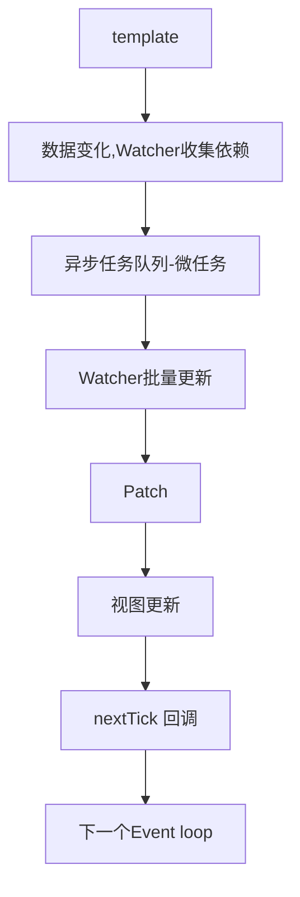

# 异步更新策略和 nextTick 原理

从之前的章节中，我们知道了从 template 到视图更新经过的过程如下：



但是，在 Patch 之后，并不是直接更新视图的，而是在异步队列中更新视图的。

## nextTick

`nextTick` 是 Vue.js 中的一个非常重要的 API。要理解 `nextTick` 的作用，我们首先需要了解 Vue.js 的异步更新队列。

Vue.js 使用异步队列来批量更新 DOM。也就是说，当你修改一个数据时，Vue.js 不会立即更新 DOM，而是将所有的依赖这个数据的 Watcher 对象放入一个队列中。这个过程被称为依赖收集。

然后，Vue.js 会等待当前同步代码执行完毕以后，在当前的宏任务（macrotask）或者同步任务完成后，即将开始的微任务阶段，开始批量执行队列中的 Watcher 对象。

这样做的好处是可以避免不必要的 DOM 更新，从而提高性能。

这就是 `nextTick` 的作用所在。`nextTick` 函数允许你在下一次 DOM 更新循环结束之后延迟执行一段代码。换句话说，`nextTick` 可以让你在数据改变之后，DOM 更新之后，执行一些操作。

下面是详细的步骤：

1. 当你修改一个响应式数据时，Vue.js 会触发这个数据的 setter 函数。
2. Setter 函数会通知所有依赖这个数据的 Watcher 对象，告诉它们数据已经改变。
3. 每个 Watcher 对象在接收到通知后，在 Watcher 的 update 中不会立即更新视图，而是将自己添加到一个全局的队列中。
4. Vue.js 有一个异步任务队列，并且使用 Promise 或者 MutationObserver 的微任务队列来延迟执行这个队列中的 Watcher 对象。
5. 当所有同步任务执行完毕，微任务队列开始执行，Vue.js 就会开始遍历这个 Watcher 队列，并且为每个 Watcher 对象执行其 run 方法，从而更新视图。在这个过程中，如果有多个 相同属性的 Watcher 对象，Vue.js 也只会更新一次视图，避免了不必要的计算和渲染，提高了性能。
6. 然后，nextTick 的回调函数会在 DOM 更新后（即所有的 Watcher 都已经执行，视图已经更新）被调用。因此，我们可以通过 nextTick 在 DOM 更新后执行一些任务，比如操作更新后的 DOM 元素。
7. 再然后，当所有的 nextTick 回调执行完后，Vue.js 就会开始执行后续的同步代码。这个过程就是 JavaScript 的事件循环（Event Loop）。

下面举个例子来帮助理解：

```javascript
new Vue({
  el: "#app",
  data: {
    message: "Hello Vue!",
  },
  methods: {
    updateMessage: function () {
      this.message = "Hello Vue3!";
      this.$nextTick(function () {
        console.log(this.$el.textContent);
      });
    },
  },
});
```

在这个例子中，我们首先更改了 `message` 的值，然后使用 `nextTick` 来确保 `console.log` 语句在 DOM 更新之后执行。如果我们没有使用 `nextTick`，那么 `console.log` 语句可能会在 DOM 更新之前执行，此时它仍然会输出原来的内容 "Hello Vue!"。

## 疑问

### Watcher 和 nextTick 的回调都是在微任务执行的

`Watcher` 的执行和 `nextTick` 的回调都是在微任务阶段执行的。

`Watcher` 对象是响应 Vue.js 数据变动的观察者，当数据变动时，`Watcher` 对象会被添加到异步任务队列中，等待下一个微任务阶段执行。

而 `nextTick` 的回调则是在 DOM 更新后（即所有的 `Watcher` 对象执行后）在同一个微任务阶段执行。

Vue.js 的异步任务队列利用了 JavaScript 的微任务（microtask）机制。微任务是在当前宏任务（macrotask）执行结束后，下一个宏任务开始前，执行的任务。因此，异步任务队列的执行时机刚好可以确保在 DOM 更新后立即执行。

至于实现这个异步任务队列，Vue.js 会优先尝试使用原生的 `Promise` 对象。如果环境中支持 `Promise`，那么 Vue.js 就会使用 `Promise.then` 来实现异步队列。如果环境中不支持 `Promise`，那么 Vue.js 会尝试使用 `MutationObserver`。如果环境中连 `MutationObserver` 都不支持，那么 Vue.js 会退而求其次，使用 `setImmediate` 或者 `setTimeout`。

因此，`Watcher` 的异步任务队列和 `nextTick` 的异步任务队列，它们的实现方式是基本一致的。都会优先使用 `Promise`，然后是 `MutationObserver`，最后是 `setImmediate` 或者 `setTimeout`。

### Watcher 队列，dom 更新，nextTick 的回调都在微任务队列执行

在一个事件循环中，先执行同步代码，如果有修改数据，则将其添加到异步队列，当所有的同步代码执行完成后，开始执行微任务队列，这时候就会执行所有的 Watcher 队列，执行完成后，执行 dom 更新，dom 更新完成后，执行 nextTick 的回调。按照这个顺序完成后，开始下一轮事件循环，对吗？

你的理解是正确的，再次总结一下你的描述：

1. **执行同步代码**：在当前的事件循环（Event Loop）中，首先执行所有的同步代码。

2. **修改数据**：如果在同步代码中有数据被修改，对应的 `Watcher` 会被添加到异步队列中。

3. **同步代码完成**：当所有的同步代码都执行完后，事件循环将检查微任务队列。

4. **执行微任务队列**：此时，所有标记为“脏”的 `Watcher` 会执行，触发组件的重新渲染。

5. **DOM 更新**：随着 `Watcher` 的执行，DOM 更新会发生。

6. **执行 nextTick 的回调**：在所有 DOM 更新后，所有注册到 `nextTick` 的回调会被执行。

7. **开始下一轮事件循环**：当前的事件循环完成后，如果有其他的宏任务（例如：setTimeout、setInterval、I/O 操作等）在队列中，那么下一个事件循环会开始，并处理这些宏任务。

### 为什么要在微任务中更新视图？

1. 保证在同一事件循环中完成数据更新与视图更新。数据更新和视图更新放在同一个宏任务中,可以确保在同一事件循环中完成,避免数据和视图不同步的情况。
2. 批量更新,提高性能。使用微任务队列,可以将同一事件循环内的多次数据变更缓冲起来,只刷新一次视图,避免不必要的重绘和重排。
3. 遵循 DOM 渲染时机。微任务的执行时机是在 DOM 渲染之前,这确保了 DOM 状态不会在一个事件循环中被多次更新。
4. 保证合理的执行顺序。微任务会在宏任务之后、UI 渲染之前执行,可以保证在渲染视图之前执行完所有数据更新逻辑。

### 怎么样才叫一个事件循环？

一个事件循环就是宏任务+微任务。

如何定义一个宏任务？

宏任务（Macro Task）和微任务（Micro Task）是 JavaScript 事件循环中的两种不同类型的任务。宏任务是事件循环中的主要任务，每个宏任务都会引发一次完整的事件循环。

以下是一些常见的宏任务：

1. **主脚本**：浏览器加载页面时首次执行的 JavaScript 脚本。
2. **定时器**：通过 `setTimeout` 和 `setInterval` 设置的回调函数。
3. **UI 渲染**：浏览器的渲染和重绘任务（注意，不是所有的 UI 更新都是宏任务，例如 Vue 的异步更新是微任务）。
4. **I/O**：例如网络请求的回调（如 `XMLHttpRequest`）。
5. **事件**：例如鼠标点击、键盘输入等浏览器事件的回调。

定义宏任务的核心是：它们在事件循环的每个迭代中被单独处理，并在处理完毕后，事件循环会处理微任务队列中的所有任务。

从技术上讲，当 JavaScript 运行时环境（如浏览器或 Node.js）检测到一个宏任务需要执行时，它会将这个任务添加到宏任务队列。事件循环会依次从这个队列中取出任务并执行。每执行完一个宏任务，事件循环都会检查并处理微任务队列中的任务，直到微任务队列为空，然后再回到宏任务队列取出下一个宏任务。

这样的机制确保了 JavaScript 代码的同步执行性质，同时也允许异步事件和操作得以插入和处理。

## 如何保证 nextTick 的回调会在 watcher 队列执行完，dom 更新后执行呢？

其实 vue 并没有处理 nextTick 的回调一定会在 Watcher 队列之后执行，因为它们都是在微任务中执行的，所以我们需要手动的把 nextTick 代码写在最后，来保证代码逻辑的正常。我的理解对吧？

你的理解是正确的。Vue 确实没有强制保证`$nextTick`的回调一定会在 Watcher 队列之后执行，因为它们都是在微任务队列中执行，没有明确的先后顺序。

所以，为了确保代码逻辑的正常执行，通常需要手动将`$nextTick`的调用放在 Watcher 队列之后，以确保在 DOM 更新后执行相关操作。

这是一种常见的做法，特别是当你依赖于 DOM 更新后的状态来执行特定的操作。通过将`$nextTick`的回调放在数据变化之后，你可以更好地控制执行顺序，以满足你的需求。

## 现在

现在，template 到视图更新经过的过程如下：


